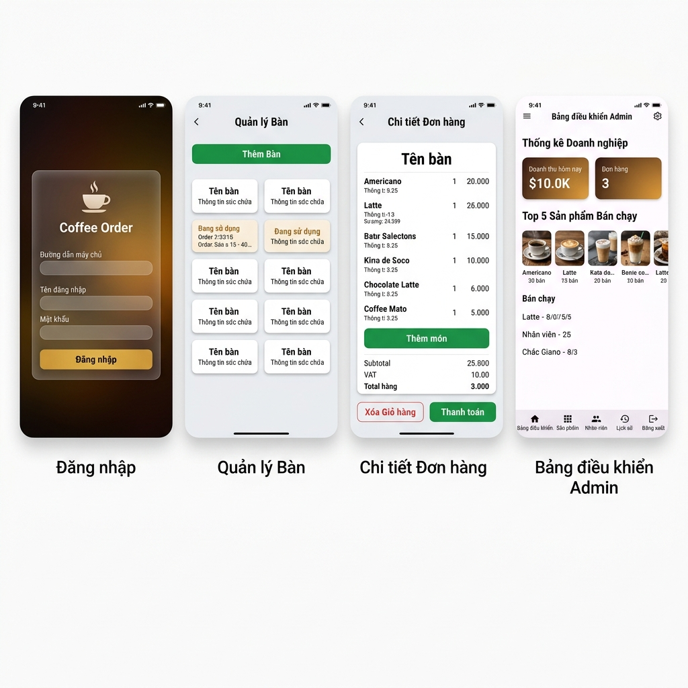

# BÁO CÁO TỔNG HỢP TIỂU LUẬN
# Ứng dụng Quản lý Quán Cà phê — Coffee Order

> **Môn học:** Phát triển ứng dụng di động  
> **Công nghệ:** Kotlin · Android · Ktor · Jetpack Compose  
> **Nội dung:** Báo cáo tổng hợp toàn bộ tài liệu kiến trúc, luồng hoạt động và mã nguồn.

---

## Mục lục

1. [Giới thiệu](#1-giới-thiệu)
2. [Thiết kế hệ thống cơ sở](#2-thiết-kế-hệ-thống-cơ-sở)
   - 2.1. [Tổng quan cấu trúc dự án](#21-tổng-quan-cấu-trúc-dự-án)
   - 2.2. [Sơ đồ Use Case](#22-sơ-đồ-use-case)
   - 2.3. [Sơ đồ Data Model (ER)](#23-sơ-đồ-data-model-er)
   - 2.4. [Kiến trúc hệ thống (Architecture Model)](#24-kiến-trúc-hệ-thống-architecture-model)
3. [Phân Tích Luồng Nghiệp Vụ Chuyên Sâu](#3-phân-tích-luồng-nghiệp-vụ-chuyên-sâu)
   - 3.1. [Luồng đặt món (Order Core Flow)](#31-luồng-đặt-món-order-core-flow)
   - 3.2. [Tuần tự gọi API (Sequence Flow)](#32-tuần-tự-gọi-api-sequence-flow)
4. [Chi Tiết Triển Khai Code (Implementation)](#4-chi-tiết-triển-khai-code-implementation)
   - 4.1. [Kiến Trúc App: EmployeeActivity & BaseFragment](#41-kiến-trúc-app-employeeactivity--basefragment)
   - 4.2. [Giải Phẫu Các Chức Năng Nhân Viên](#42-giải-phẫu-các-chức-năng-nhân-viên)
   - 4.3. [Server: Xác Thực, Phân Quyền & Repository](#43-server-xác-thực-phân-quyền--repository)
5. [Kết quả — Giao diện ứng dụng](#5-kết-quả--giao-diện-ứng-dụng)
6. [Kết luận](#6-kết-luận)

---

## 1. Giới thiệu

**Coffee Order** là một ứng dụng quản lý quán cà phê toàn diện, được phát triển trên nền tảng **Android** với mục tiêu số hóa toàn bộ quy trình vận hành — từ tiếp nhận khách hàng, đặt món, thanh toán cho đến quản lý doanh thu. Ứng dụng hướng tới hai nhóm người dùng chính:
1. **Employee (Nhân viên):** Nhân viên phục vụ khách tại bàn.
2. **Owner (Quản lý/Chủ quán):** Mang đầy đủ quyền hạn của nhân viên và bổ sung chức năng quản lý, thiết lập hệ thống và báo cáo.

Ứng dụng được xây dựng theo kiến trúc **Client–Server** hiện đại:
- **Client (Android App):** Sử dụng mô hình **MVVM** với Kotlin, kết hợp **XML Layouts** cho nhân viên và **Jetpack Compose** cho trang quản trị.
- **Server (Ktor Backend):** API RESTful với xác thực **JWT**, sử dụng **JetBrains Exposed** ORM để thao tác cơ sở dữ liệu.
- **Shared Module:** Module dùng chung giữa App và Server, chứa các DTO và models, đảm bảo tính nhất quán dữ liệu giữa hai nền tảng.

Điểm nổi bật của dự án là sử dụng **100% Kotlin** trên toàn bộ stack, không lặp lại code nhờ chia sẻ Data Request/Response Data Classes giữa Frontend và Backend.

---

## 2. Thiết kế hệ thống cơ sở

### 2.1. Tổng quan cấu trúc dự án

Dự án được tổ chức dưới dạng **Multi-Module Gradle Project** với 3 module:
- `:app`: Ứng dụng Android (client) (Kotlin, MVVM, Compose, XML).
- `:server`: Backend API server (Ktor, Netty, Exposed ORM, JWT).
- `:shared`: Dữ liệu dùng chung (Kotlin Data Classes định nghĩa các DTOs tránh lặp lại mã khai báo ở cả hai bên).

---

### 2.2. Sơ đồ Use Case

Hệ thống được thiết kế phục vụ tối đa trải nghiệm của hai nhóm người dùng chính, với phân cấp quyền hạn rõ ràng, đảm bảo tính bảo mật và vận hành khép kín.

#### 2.2.1. Sơ đồ Use Case tổng quan

Bức tranh toàn cảnh về mặt phân quyền và tính năng của toàn bộ hệ thống Coffee Order được mô tả ở sơ đồ dưới đây. Trong đó, hệ thống sử dụng nguyên lý kế thừa quyền hạn: **Admin (Chủ quán)** sẽ kế thừa toàn bộ các chức năng thao tác nghiệp vụ tại quầy của **Employee (Nhân viên)**.


> **Phân quyền chung (Nhân viên - Employee):**
> Có thể thao tác trực tiếp với khách hàng tại quầy. Bao gồm: Đăng nhập/Đăng xuất, Xem danh sách bàn/trạng thái bàn, Thêm bàn mới. Đặc biệt là quy trình lên đơn: Chọn món vào giỏ, điều chỉnh số lượng. Gửi yêu cầu cập nhật đơn hàng và thực hiện Checkout (Thanh toán).
> 
> **Phân quyền bổ sung (Admin - Owner):**
> Kế thừa toàn quyền của Nhân viên cộng thêm thao tác Quản trị hệ thống:
> - **Quản lý Menu:** CRUD sản phẩm, cập nhật giá và hình ảnh.
> - **Quản lý Nhân Viên:** Tạo mới hoặc xóa tài khoản.
> - **Quản lý Kinh doanh:** Xem báo cáo thống kê trên Dashboard (Doanh thu hôm nay, tổng đơn hàng, top món bán chạy).

---

#### 2.2.2. Use Case — Xác Thực & Phân Quyền (Auth Flow) 

Trước khi truy cập hệ thống, mọi thao tác đều phải đi qua luồng xác thực chứng danh nghiêm ngặt dựa trên chuỗi JWT.


*(Sơ đồ luồng Xác thực)*

**Diễn giải luồng chạy:**
1. Nhân viên mở App, có thể tự do cấu hình lại Base API URL của server.
2. Nhập thông tin đăng nhập. Dữ liệu được mã hóa truyền tải lên server API.
3. Server sử dụng `BCrypt.verify` so khớp hash mật khẩu. 
4. Nếu hợp lệ, một token JWT được sinh ra đính kèm Role (`OWNER` hoặc `EMPLOYEE`).
5. Dựa trên chuỗi token này, Application sẽ chuyển hướng đến luồng màn hình Activity tương ứng, ngăn chặn tuyệt đối nhân viên truy cập vào màn hình cấu hình giá của quán.

---

#### 2.2.3. Use Case — Luồng Lên Đơn & Thanh Toán (Order Flow) 

Đây là trung tâm nghiệp vụ của App, phục vụ trực tiếp vòng đời của 1 Order từ lúc khách vào bàn đến lúc rời đi.


*(Quy trình Lên đơn và Thanh toán hóa đơn)*

**Diễn giải luồng chạy:**
1. Nhân viên ở màn hình `ManagementFragment` theo dõi lưới các Bàn. Có thể dùng bảng chọn `AddTableBottomSheet` để kê thêm bàn mới khi khách đông.
2. Truy cập vào môt bàn, mở Menu chọn món (`Cart.addItem`). Giỏ hàng (Cart) cho phép điều chỉnh số lượng hoặc xóa món tùy ý.
3. Thực thi hành động gửi đơn (`Submit Order`), quá trình này gọi RESTful API đến server kèm theo chuỗi JSON cấu trúc món hàng. Bàn sẽ bị khóa ở trạng thái Occupied.
4. Quá trình tính phí, VAT tự động cộng vào biên lai. Khi khách ra về, thao tác **Thanh toán**, order này sẽ đóng lại hoàn toàn.

---

#### 2.2.4. Use Case — Quản Trị Hệ Thống (Admin Flow) 

Dành riêng cho màn hình `AdminActivity` thông qua bộ giao diện Jetpack Compose, cho phép thao tác ở góc độ quản lý vĩ mô.


*(Kiểm soát và Báo cáo dành cho Chủ quán)*

**Diễn giải luồng chạy:**
1. **Kiểm soát Kinh doanh:** Cập nhật Live data về Doanh thu, top những đồ uống bán chạy nhất ngay ngoài màn hình Dashboard.
2. **Kiểm soát Nhân sự:** Thêm nhân viên mới (Gọi API đăng ký tài khoản với quyền Staff).
3. **Kiểm soát Item:** Thực thi việc tạo menu item, cập nhật giá cũng như khả năng Upload (Multipart Form Data) hình ảnh đồ uống lưu trữ vào thư mục static của Backend.

---

### 2.3. Sơ đồ Data Model (ER)

Cơ sở dữ liệu được thiết kế với 5 bảng chính, sử dụng JetBrains Exposed ORM. Mức độ chuẩn hóa cao để duy trì sự độc lập giữa giá cả menu hiện tại và doanh thu quá khứ.


1. **`users`**: Chứa thông tin đăng nhập (`username`, `password_hash`) và thuộc tính quyền `role` (OWNER/EMPLOYEE).
2. **`coffee_tables`**: Chứa danh sách các bàn vật lý.
3. **`menu_items`**: Thực đơn đồ uống kèm đường dẫn ảnh.
4. **`orders`**: Cột **`is_paid`** quyết định vòng đời hoá đơn. Trạng thái `is_paid = false` cho biết đây là Active Order rập theo bàn. Khi `is_paid = true`, hóa đơn bị khóa lại và được tính vào doanh thu.
5. **`order_line_items`**: Bảng N-N. Ghi nhận số lượng món và, quan trọng, giá tiền chốt tại thời điểm đặt **`unit_price`**.

---

### 2.4. Kiến trúc hệ thống (Architecture Model)

Hệ thống tuân theo kiến trúc **Layered Architecture** với sự phân tách rõ ràng.


- **UI Layer (View)**: Xây dựng bằng XML cho Employee và Compose cho Admin. Chỉ hiển thị dữ liệu và đẩy Event.
- **ViewModel Layer (`AppViewModel`)**: Giữ UI State thông qua `StateFlow<AppUiState>`. Khi state thay đổi, UI sẽ quan sát và re-render tự động.
- **Network Layer (`ApiClient`)**: Giao tiếp qua HTTP sử dụng **Ktor Client**. Tự động attach JWT từ `TokenManager`.
- **Backend (Ktor Plugins & Routes)**: Middleware xử lý Security, CORS, Serialization. Các Endpoint được chia logic làm các Routes riêng biệt (Menu, Table, Order).
- **Data Layer (Exposed DAO)**: Mapping hướng đối tượng và tương tác câu lệnh SQL an toàn.

---

## 3. Phân Tích Luồng Nghiệp Vụ Chuyên Sâu

### 3.1. Luồng đặt món (Order Core Flow)

Hành trình Mở Bàn - Gọi Món - Thanh Toán tại quầy là mạch máu của ứng dụng.


**Quy trình và Trạng thái:**
1. **Khởi Tạo Trạng Thái (Status check):** 
   - View kiểm tra thuộc tính `orderItems` của bàn. Nếu rỗng -> Trạng thái **Trống (Empty)**. Nếu có items -> Trạng thái **Đang có khách (Occupied)**.
   - Khi App chọn một bàn, hệ thống đẩy khởi tạo Giỏ Hàng (*Cart Virtual*) vào trong RAM thiết bị. 
2. **Thao Tác Giỏ Hàng Cục Bộ (Optimistic UI):**
   - Nhân viên thêm/bớt, chỉnh số lượng món. Hành động này **KHÔNG** bắn request mạng ngay lập tức. Mọi cập nhật được xử lý tức thời nội bộ trong App Client mang lại độ trơn tru tuyệt đối.
3. **Xác Nhận Đồng Bộ (Order Synchronization):**
   - Nhấn **Xác Nhận (Submit)**. Client gom các hạng mục đang nằm ở thiết bị thành một JSON Payload tinh gọn gửi lên API `POST /api/orders`.
   - Server kiểm tra: Nếu bàn đang trống, tạo biểu ghi `orders` mới. Nếu đang có khách, dùng hóa đơn hiện hữu. Cập nhật (INSERT/DELETE) chuỗi `line_items`. 
4. **Thanh Toán (Checkout / Release Execute):**
   - Lệnh `PUT /api/orders/{id}/pay` được gọi. Server gán Order thành `is_paid = true`. 
   - Hóa đơn cũ bị đóng băng. Bàn trở về trạng thái trống rỗng để đón chu kỳ khách mới.

### 3.2. Tuần tự gọi API (Sequence Flow)
- Cơ chế gọi diễn ra theo luồng: User -> View -> ViewModel chạy Coroutines -> `CoffeeOrderRepository` -> Ktor HTTP GET/POST -> Server chặn bằng JWT Middleware -> Ktor Handler -> Exposed truy xuất DB -> Trả về JSON tới Ktor Content Negotiation -> Re-render State UI.

---

## 4. Chi Tiết Triển Khai Code (Implementation)

### 4.1. Kiến Trúc App: EmployeeActivity & BaseFragment

`EmployeeActivity` đóng vai trò **Navigation Host (Trạm trung chuyển)** dùng BottomNavigationView bọc quanh Navigation Component. Các Fragment không nằm rải rác mà được tối ưu thông qua tính trừu tượng kế thừa.

**Kế thừa linh hoạt với `EmployeeBaseFragment<T>`**:
Dùng để tự động hoá việc ViewBinding và tự động nhả tham chiếu view (tránh memory leaks) khi Fragment bị hủy.

```kotlin
// app: EmployeeBaseFragment.kt
abstract class EmployeeBaseFragment<T : ViewBinding>(
    private val bindingInflater: (LayoutInflater, ViewGroup?, Boolean) -> T,
) : Fragment()
```
Biến `_binding` giữ liên kết. Hàm `onDestroyView()` sẽ gán nó về `null`.

**Tối ưu luồng State `distinctUntilChanged`:**
Tránh lỗi chớp màn hình, các Fragments không nuốt toàn bộ tổng state mà chỉ chắt lọc trường property mà nó quan tâm. Nằm trong cấu trúc thu gom state `collectFlow` với `repeatOnLifecycle(STARTED)` an toàn cho UI nền.

```kotlin
override fun collectStateAndUpdateUi() {
    collectFlow(
        appViewModel.uiState.map { it.menuItems }.distinctUntilChanged()
    ) { menuItems ->
        menuAdapter.submitList(menuItems)
    }
}
```

### 4.2. Giải Phẫu Các Chức Năng Nhân Viên

Branch `/fragment` chứa 4 màn hình chính:

1. **Quản lý Bàn (`ManagementFragment`)**: 
   Sử dụng **Multiple ViewTypes** trên `TableGridAdapter`. Code chia Layout rõ ràng (`LayoutEmptyTableBinding` và `LayoutOccupiedTableBinding`) giúp dễ thao tác giao diện mà không lo chằng chéo logic.
2. **Lên Đơn / Thanh Toán (`OrderFragment`)**:
   Chứa class lõi `Cart()` giữ `MutableStateFlow` bản tin đơn hàng. 
   Sử dụng thủ thuật kỹ thuật gọi Async kép: Gọi đệ quy hàm Request thanh toán để đảm bảo cả lúc lưu món và chốt sổ được dính chung trong Pipeline.
3. **Xem Lịch Sử (`HistoryFragment`)**:
   Dùng adapter gắn sẵn thư viện ảo hóa tiền tệ (`NumberFormat`), format double gốc thành mã tiền tệ VNĐ `vi-VN` tại chỗ rất thuận tiện. Có logic nhận diện màn hình trống rỗng.
4. **Cài Đặt (`SettingFragment`)**:
   Giải phóng TokenManager thực thi log-out. Nơi dùng Coil tải tập dữ liệu Menu bằng `ListAdapter` kết hợp `DiffCallback`.

### 4.3. Server: Xác Thực, Phân Quyền & Repository

**Bảo mật JWT và Hashing:**
Dữ liệu Password khi sinh tài khoản nhân viên mới được mã hóa một chiều qua hệ **BCrypt**.
Khi Login hợp lệ, Ktor sinh Token tồn tại 24h quy định `role`.

```kotlin
// server: AuthRoutes.kt — Xác minh đăng nhập
val verified = BCrypt.verifyer().verify(request.password.toCharArray(), user.passwordHash)
val token = JwtConfig.makeToken(user.id, user.username, role)
```

**Phân quyền (Middleware Ktor):**
Bảo vệ bằng lớp đóng gói DSL `ownerOnly` hoặc `authenticate("auth-jwt")`.

**Tầng Data Access Object (Repository):**
Khai thác Kotlin DSL của Exposed. Lệnh `dbQuery` bọc thao tác trong Dispatchers.IO để không gây nghẽn Thread API chính (NIO/Netty).

---

## 5. Kết quả — Giao diện ứng dụng

Hệ thống cho ra 4 nhóm màn hình hoạt động ổn định:



1. **Đăng nhập**: Glass-morphism API URI & credentials.
2. **Quản lý Bàn (Grid View)**: Mã hóa màu sắc, tích hợp bottom sheet thêm bàn thủ công.
3. **Chi tiết Đơn hàng**: Cart logic nội suy trực tiếp trên giao diện xử lý Order và Thanh toán.
4. **Bảng Admin (Compose)**: Component-oriented Material 3 với thẻ thống kê, dashboard đồ thị.

---

## 6. Kết luận

Ứng dụng **Coffee Order** đã hoàn thiện một chuỗi phần mềm khép kín từ Frontend tới Backend. Toàn bộ thiết kế hệ thống được xây dựng trên một triết lý chung: 
**Code Clean, Type-Safe và Multi-module Kotlin.**

Kết quả là hệ thống đã giải quyết trọn vẹn:
- Phân quyền (JWT Access Control)
- Quản lý Lifecycle an toàn, không thất thoát ram (Memory Leak-Free) với view bindings
- Cơ sở liệu an toàn (H2/JetBrains Exposed) tách bạch phiên giá cũ và mới `order_line_items.unit_price`.

Với các bộ tài liệu trên, việc Scale-Up các tính năng khác (như WebSocket cập nhật Live Table hay Offline SQLite Cash-mode) trong tương lai hoàn toàn có thể tích hợp mượt mà.

---
*Tài liệu tổng hợp dựa trên 6 sub-documents gốc (*`architecture.md`, `activity.md`, `employee_activity_architecture.md`...*).*  
*Toàn bộ sơ đồ UML được mã hóa bằng chuẩn cơ sở PlantUML (.puml).*
